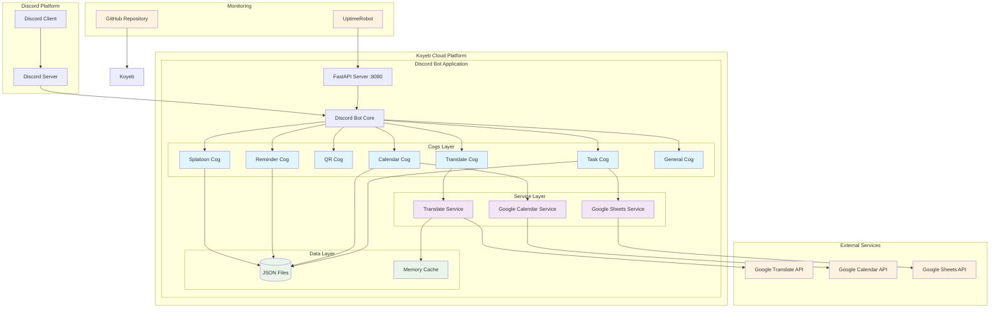
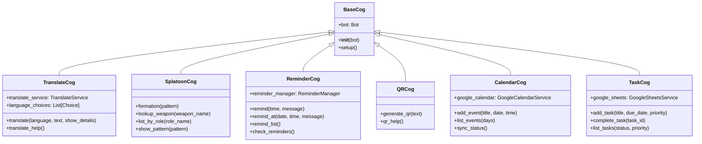
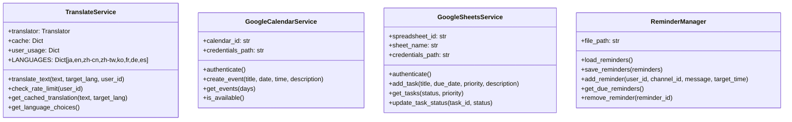
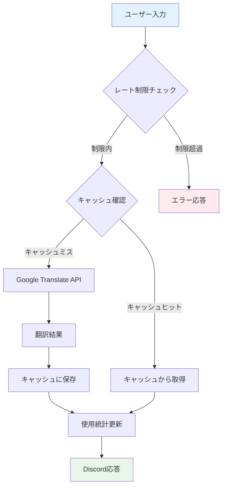
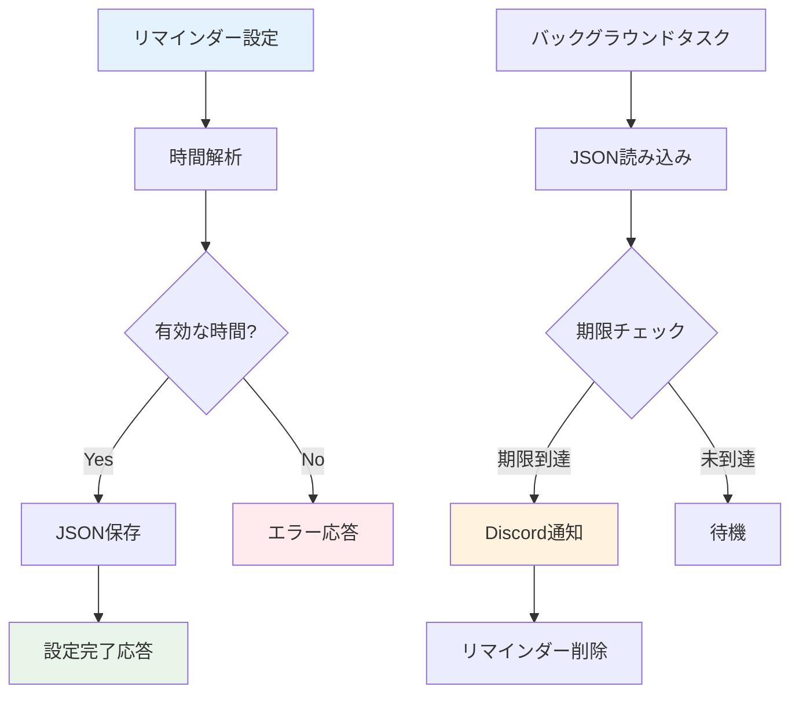
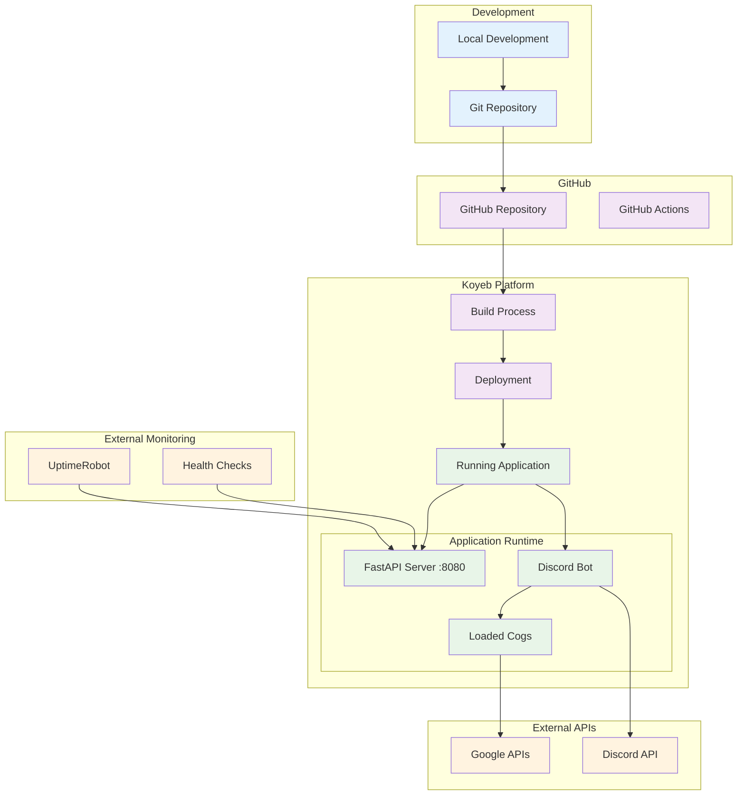

# システムアーキテクチャ

## 🎯 概要

Discord Botは多機能なサーバーサイドアプリケーションとして設計されており、翻訳、スプラトゥーン、QRコード、リマインダー、カレンダー、タスク管理機能を提供します。

## 🏗️ システム全体アーキテクチャ



## 🔧 コンポーネント構成

### 1. **プレゼンテーション層（Cogs）**



### 2. **サービス層**



## 📊 データフロー図

### 翻訳機能のデータフロー



### リマインダー機能のデータフロー



## 🚀 デプロイメント構成



## 🔄 技術スタック

### **フロントエンド**
- **Discord Client**: ユーザーインターフェース
- **Discord Slash Commands**: コマンド入力システム

### **バックエンド**
- **Python 3.11+**: メインプログラミング言語
- **discord.py 2.3.2+**: Discord API ライブラリ
- **FastAPI**: Web サーバーフレームワーク
- **uvicorn**: ASGI サーバー

### **外部サービス**
- **Google Translate API**: 翻訳機能
- **Google Calendar API**: カレンダー連携
- **Google Sheets API**: タスク管理連携

### **データストレージ**
- **JSON Files**: ローカルデータ永続化
- **Memory Cache**: 翻訳結果キャッシュ
- **Google Services**: クラウドデータ同期

### **インフラストラクチャ**
- **Koyeb**: クラウドホスティング
- **GitHub**: ソースコード管理
- **UptimeRobot**: 監視・ヘルスチェック

## 🛡️ セキュリティ・制限

### **レート制限**
- 翻訳機能: ユーザー毎に1分3回、1時間20回、1日50回
- リマインダー: 最大30日間設定可能
- QRコード: 特別な制限なし

### **データ保護**
- 環境変数による機密情報管理
- Google API認証情報の安全な保存
- ユーザーデータの最小限収集

### **エラーハンドリング**
- 各機能での包括的例外処理
- ユーザーフレンドリーなエラーメッセージ
- ログ記録とデバッグ情報

## 📈 スケーラビリティ

### **現在の制限**
- 単一インスタンス実行
- メモリベースキャッシュ
- ローカルJSONファイル

### **将来の拡張**
- データベース連携（PostgreSQL/MongoDB）
- Redis キャッシュ
- マルチインスタンス対応
- 負荷分散

## 🔧 設定管理

### **環境変数**
```bash
# 必須
DISCORD_TOKEN=your_discord_token

# Google連携（オプション）
GOOGLE_CREDENTIALS_PATH=credentials.json
GOOGLE_CALENDAR_ID=primary
GOOGLE_SPREADSHEET_ID=your_spreadsheet_id
GOOGLE_SHEET_NAME=Tasks

# 翻訳機能設定（オプション）
TRANSLATE_CACHE_SIZE=1000
TRANSLATE_MAX_TEXT_LENGTH=300
```

### **設定ファイル**
- `data/weapon_to_groups.json`: スプラトゥーンブキデータ
- `data/team_patterns.json`: チーム編成パターン
- `data/reminders.json`: リマインダーデータ（自動生成）
- `data/events.json`: カレンダーデータ（自動生成）
- `data/tasks.json`: タスクデータ（自動生成）

## 🚀 パフォーマンス特性

### **応答時間**
- 一般コマンド: < 100ms
- 翻訳機能: 1-3秒（キャッシュ時 < 100ms）
- QRコード生成: < 500ms
- Google API連携: 1-5秒

### **メモリ使用量**
- ベースBot: ~50MB
- 翻訳キャッシュ: ~10MB（1000エントリ）
- JSONデータ: < 1MB

### **同時処理**
- 非同期処理による高い応答性
- 翻訳API呼び出しの並列実行
- バックグラウンドタスクの独立実行