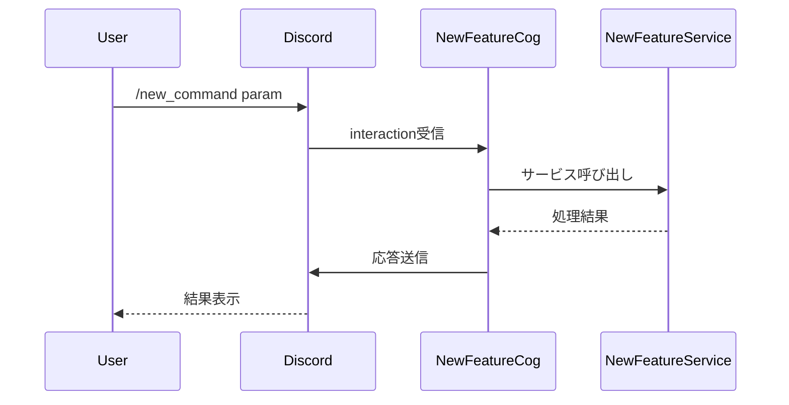

# 開発ガイド - 新機能追加チェックリスト

## 🎯 概要

Discord Botに新機能やコマンドを追加する際の完全なチェックリストです。更新漏れを防ぎ、一貫性のある実装を保つために使用してください。

## 📋 新機能追加の完全チェックリスト

### 1. 📁 ファイル作成・更新

#### ✅ 必須ファイル

**新しいCogファイル作成**
- [ ] `app/cogs/{feature_name}.py` - メインのCogクラス
- [ ] 必要に応じて `app/services/{feature_name}_service.py` - サービス層

**既存ファイル更新**
- [ ] `app/bot.py` - 新しいCogの読み込み追加
- [ ] `app/cogs/general.py` - helpコマンドに機能追加
- [ ] `requirements.txt` - 新しい依存関係追加（必要な場合）
- [ ] `.env.example` - 新しい環境変数追加（必要な場合）

#### ✅ ドキュメントファイル

- [ ] `README.md` - 機能説明追加
- [ ] `docs/ARCHITECTURE.md` - アーキテクチャ図更新
- [ ] `docs/SEQUENCE_DIAGRAMS.md` - シーケンス図追加
- [ ] `docs/FEATURES.md` - 詳細機能説明追加（存在する場合）

### 2. 🔧 実装内容

#### ✅ Cogクラスの実装

**基本構造**
```python
import discord
from discord.ext import commands
from discord import app_commands

class {FeatureName}Cog(commands.Cog):
    def __init__(self, bot):
        self.bot = bot
        # サービス初期化（必要な場合）
        
    @app_commands.command(name="{command_name}", description="コマンドの説明")
    @app_commands.describe(param="パラメータの説明")
    async def {command_method}(self, interaction: discord.Interaction, param: str):
        # 実装内容
        pass

class {FeatureName}Help(commands.Cog):
    def __init__(self, bot):
        self.bot = bot
        
    @app_commands.command(name="{feature_name}_help", description="{機能名}のヘルプを表示します")
    async def help(self, interaction: discord.Interaction):
        # ヘルプ内容
        pass

async def setup(bot):
    await bot.add_cog({FeatureName}Cog(bot))
    await bot.add_cog({FeatureName}Help(bot))
```

**必須要素チェック**
- [ ] `__init__` メソッドでbotインスタンス保存
- [ ] 各コマンドに適切な `@app_commands.command` デコレータ
- [ ] パラメータに `@app_commands.describe` でわかりやすい説明
- [ ] エラーハンドリング（try-except）
- [ ] `{feature_name}_help` コマンドの実装
- [ ] `setup` 関数での適切なCog登録

#### ✅ サービスクラスの実装（必要な場合）

**基本構造**
```python
class {FeatureName}Service:
    def __init__(self):
        # 初期化処理
        pass
        
    def {method_name}(self, param):
        # サービスロジック
        pass
```

### 3. 📝 bot.py の更新

#### ✅ Cog読み込み追加

**追加場所**: `setup_hook` メソッド内

```python
try:
    await self.load_extension("app.cogs.{feature_name}")
    print("✅ {FeatureName} cog loaded")
except Exception as e:
    print(f"❌ Failed to load {feature_name} cog: {e}")
```

**チェック項目**
- [ ] 適切な位置に追加（既存のCog読み込みと同じパターン）
- [ ] エラーハンドリング付き
- [ ] 成功・失敗ログメッセージ
- [ ] 機能名の一貫性

### 4. 🤖 general.py の更新

#### ✅ helpコマンドの更新

**追加場所**: `help` メソッドの `response` 文字列

```python
"**🎯 {機能名}機能**\n"
"• `/{command_name}` - {コマンドの説明}\n"
"• `/{feature_name}_help` - {機能名}機能のヘルプ\n\n"
```

**チェック項目**
- [ ] 適切な絵文字アイコン使用
- [ ] 機能名の統一
- [ ] コマンド一覧の完全性
- [ ] ヘルプコマンドの記載
- [ ] 実装状況の明記（実装予定の場合は ⚠️ マーク）

**更新例**
```python
response = (
    "**🤖 Discord Bot コマンド一覧**\n\n"
    # ... 既存の機能 ...
    "**🎯 新機能**\n"
    "• `/new_command` - 新しいコマンドの説明\n"
    "• `/new_help` - 新機能のヘルプ\n\n"
    # ... 残りの機能 ...
)
```

### 5. 📚 README.md の更新

#### ✅ 更新箇所一覧

**1. 概要セクション**
```markdown
## 🎯 概要
- 新機能を主要機能リストに追加
```

**2. プロジェクト構成**
```markdown
├── app/cogs/
│   ├── {feature_name}.py     # 新機能
```

**3. 利用可能な機能セクション**
```markdown
### 🎯 新機能名
- `/new_command` - コマンドの説明
- `/new_help` - ヘルプコマンド
- 機能の特徴や制限事項
```

**4. 機能詳細セクション（必要な場合）**
```markdown
## 🎯 新機能の詳細

### 対応項目
| 項目 | 内容 |
|------|------|
| 項目1 | 説明1 |

### 使用制限
- 制限1
- 制限2

### 使用例
```
/new_command example
→ 結果例
```
```

**5. トラブルシューティング**
```markdown
### 新機能の問題
| 症状 | 対策 |
|------|------|
| エラー1 | 対策1 |
```

**6. 技術的特徴**
```markdown
### 🏗️ アーキテクチャ
- 新機能のサービス層追加
```

### 6. 📊 ドキュメント更新

#### ✅ ARCHITECTURE.md の更新

**更新箇所**
- [ ] システム全体アーキテクチャ図に新コンポーネント追加
- [ ] コンポーネント構成図にCog・Service追加
- [ ] データフロー図（必要な場合）
- [ ] 技術スタックに新しい依存関係追加

**Mermaid図の更新例**
```mermaid
subgraph "Cogs Layer"
    # 既存のCog...
    NC[New Feature Cog]  # 追加
end

subgraph "Service Layer"
    # 既存のService...
    NS[New Feature Service]  # 追加
end
```

#### ✅ SEQUENCE_DIAGRAMS.md の更新

**追加内容**
- [ ] 新機能のメイン処理シーケンス図
- [ ] エラーハンドリングのシーケンス図
- [ ] 外部API連携がある場合のシーケンス図

**シーケンス図テンプレート**


### 7. 🧪 テスト・検証

#### ✅ 動作確認チェックリスト

**基本動作**
- [ ] コマンドが正常に実行される
- [ ] ヘルプコマンドが正常に表示される
- [ ] エラーハンドリングが適切に動作する
- [ ] パラメータ補完が動作する（実装している場合）

**統合確認**
- [ ] 他の機能に影響を与えていない
- [ ] Bot起動時にCogが正常に読み込まれる
- [ ] `/help` コマンドに新機能が表示される
- [ ] 環境変数が正しく読み込まれる（使用している場合）

**エラーケース**
- [ ] 無効なパラメータでのエラー処理
- [ ] 権限不足時のエラー処理
- [ ] 外部API障害時のエラー処理（使用している場合）

### 8. 🔄 依存関係・環境設定

#### ✅ requirements.txt 更新

**新しいライブラリ追加時**
```txt
# 既存の依存関係...
new-library>=1.0.0  # 新機能用ライブラリ
```

**チェック項目**
- [ ] バージョン指定の適切性
- [ ] ライセンス互換性の確認
- [ ] セキュリティ脆弱性の確認

#### ✅ .env.example 更新

**新しい環境変数追加時**
```bash
# 既存の環境変数...

# 新機能設定
NEW_FEATURE_API_KEY=your_api_key_here
NEW_FEATURE_SETTING=default_value
```

### 9. 📋 コードレビューチェックリスト

#### ✅ コード品質

**一般的な品質**
- [ ] PEP 8 スタイルガイドに準拠
- [ ] 適切なコメント・docstring
- [ ] 変数・関数名の一貫性
- [ ] エラーハンドリングの適切性

**Discord Bot特有**
- [ ] `interaction.response.defer()` の適切な使用
- [ ] `ephemeral=True` の適切な使用
- [ ] Embed使用時の適切なフォーマット
- [ ] レート制限への配慮

**セキュリティ**
- [ ] 入力値検証の実装
- [ ] 機密情報の適切な管理
- [ ] SQLインジェクション等の脆弱性対策

### 10. 🚀 デプロイ前最終チェック

#### ✅ デプロイ準備

**ファイル確認**
- [ ] 全ての変更ファイルがコミットされている
- [ ] `.env` ファイルが `.gitignore` に含まれている
- [ ] 不要なデバッグコードが削除されている

**ドキュメント確認**
- [ ] README.md の更新完了
- [ ] アーキテクチャ図の更新完了
- [ ] シーケンス図の追加完了
- [ ] コメント・docstringの記載完了

**動作確認**
- [ ] ローカル環境での動作確認完了
- [ ] 全機能の回帰テスト完了
- [ ] エラーケースの確認完了

## 📝 機能別実装パターン

### パターン1: 単純なコマンド機能

**例**: ping, help等の情報表示系

**必要ファイル**
- `app/cogs/{feature_name}.py`
- `app/bot.py` (Cog読み込み)
- `app/cogs/general.py` (help更新)
- `README.md`

### パターン2: 外部API連携機能

**例**: 翻訳機能、QRコード生成

**必要ファイル**
- `app/cogs/{feature_name}.py`
- `app/services/{feature_name}_service.py`
- `requirements.txt` (新ライブラリ)
- `.env.example` (API設定)
- 上記 + 基本ファイル

### パターン3: データ永続化機能

**例**: リマインダー、カレンダー

**必要ファイル**
- `app/cogs/{feature_name}.py`
- `app/services/{feature_name}_service.py`
- `data/{feature_name}.json` (自動生成)
- 上記 + 基本ファイル

### パターン4: Google連携機能

**例**: カレンダー、タスク管理

**必要ファイル**
- `app/cogs/{feature_name}.py`
- `app/services/{feature_name}_service.py`
- `requirements.txt` (Google API)
- `.env.example` (Google設定)
- `credentials.json` (手動配置)
- 上記 + 基本ファイル

## 🔍 よくある実装ミス

### ❌ 更新漏れパターン

1. **helpコマンド更新忘れ** → ユーザーが新機能を発見できない
2. **README.md更新忘れ** → ドキュメントが古いまま
3. **エラーハンドリング不足** → 予期しないエラーでBot停止
4. **Cog読み込み忘れ** → 機能が動作しない
5. **環境変数設定忘れ** → 本番環境で動作しない

### ✅ 品質向上のコツ

1. **一貫性の保持** → 既存機能と同じパターンを踏襲
2. **ユーザビリティ** → わかりやすいコマンド名・説明
3. **エラーメッセージ** → ユーザーが対処法を理解できる内容
4. **ドキュメント** → 実装と同時に更新
5. **テスト** → 正常系・異常系両方の確認

## 📋 チェックリスト印刷用

```
新機能追加チェックリスト

□ app/cogs/{feature_name}.py 作成
□ app/services/{feature_name}_service.py 作成（必要時）
□ app/bot.py にCog読み込み追加
□ app/cogs/general.py のhelp更新
□ requirements.txt 更新（必要時）
□ .env.example 更新（必要時）
□ README.md 更新（概要・構成・機能・トラブルシュート）
□ docs/ARCHITECTURE.md 更新
□ docs/SEQUENCE_DIAGRAMS.md 更新
□ 基本動作テスト
□ エラーハンドリングテスト
□ 統合テスト
□ ドキュメント最終確認
□ デプロイ準備完了
```

このチェックリストを使用することで、新機能追加時の更新漏れを防ぎ、一貫性のある高品質な実装を維持できます。