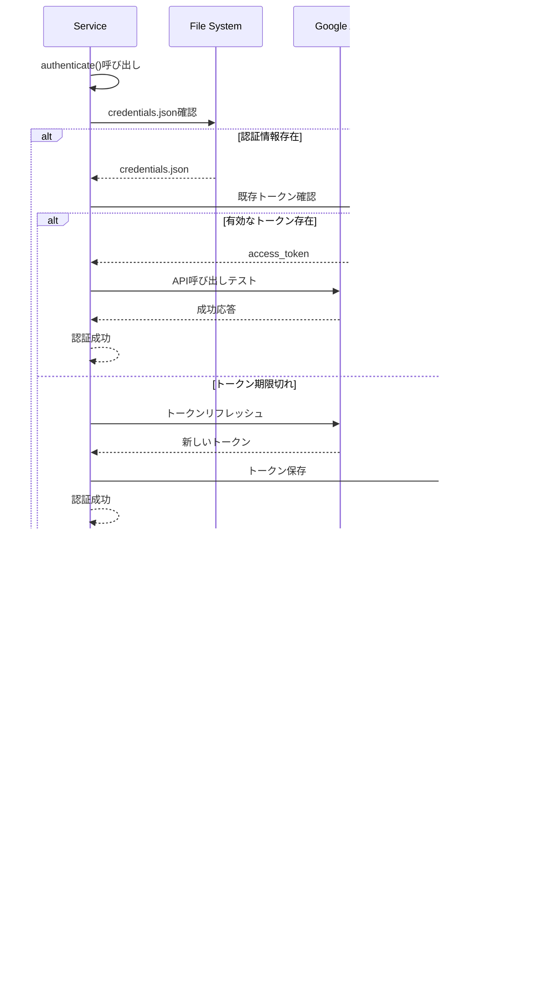

# シーケンス図

## 🎯 概要

Discord Botの各機能における処理フローを詳細に示すシーケンス図集です。ユーザーの操作から最終的な応答まで、システム内部の動作を時系列で表現しています。

## 🚀 基本機能

### 1. Bot起動・初期化プロセス

### 2. エラーハンドリング

## 🌐 翻訳機能

### 3. 翻訳処理（成功パターン）

### 4. 言語選択機能

### 5. 翻訳エラー処理

## 🎮 スプラトゥーン機能

### 5. チーム編成処理

### 6. ブキ情報検索

## 📱 QRコード機能

### 7. QRコード生成処理

## ⏰ リマインダー機能

### 8. リマインダー設定処理

### 9. リマインダー実行（バックグラウンド）

### 10. スレッドメンション処理

## 📅 カレンダー機能

### 11. 予定追加（Google連携）

### 12. 予定追加（ローカルのみ）

## 📋 タスク管理機能

### 13. タスク追加（Google連携）

### 14. タスク完了処理

## 🔄 共通処理

### 15. Google API認証

### 16. データ同期処理

## 📊 パフォーマンス考慮事項

### 応答時間の最適化
- **キャッシュ活用**: 翻訳結果の再利用
- **非同期処理**: API呼び出しの並列実行
- **defer応答**: 長時間処理の応答性確保

### エラー回復
- **フォールバック**: Google API失敗時のローカル処理
- **リトライ**: 一時的な障害への対応
- **タイムアウト**: 無限待機の防止

### リソース管理
- **メモリ制限**: キャッシュサイズの制御
- **ファイルI/O**: JSON読み書きの最適化
- **API制限**: レート制限の遵守